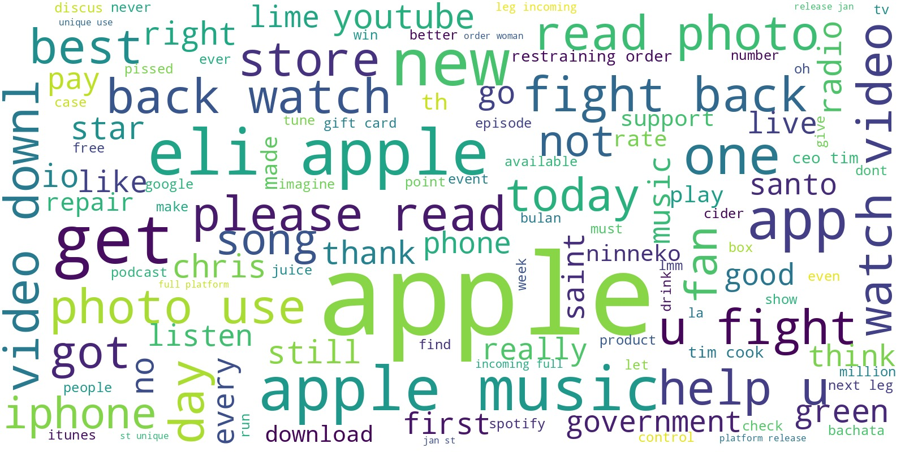
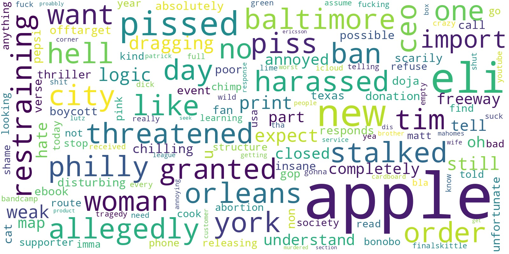
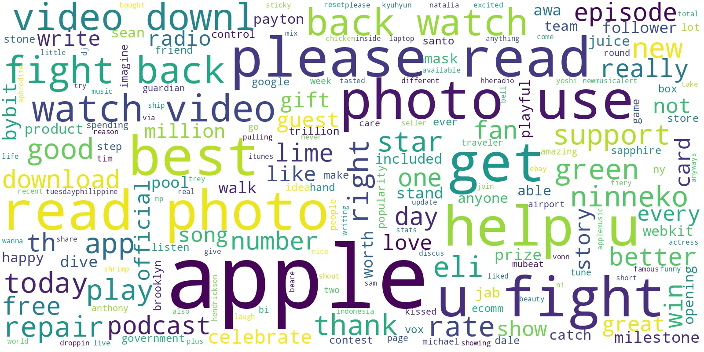
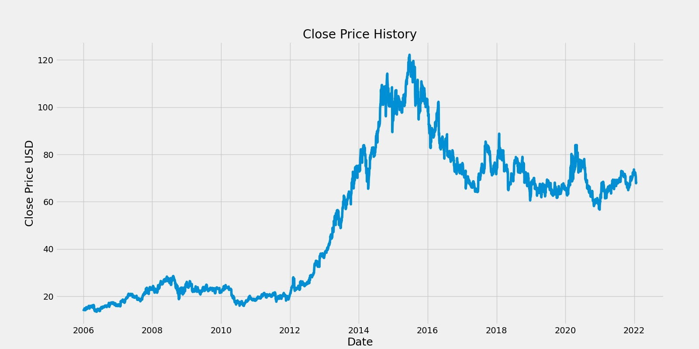
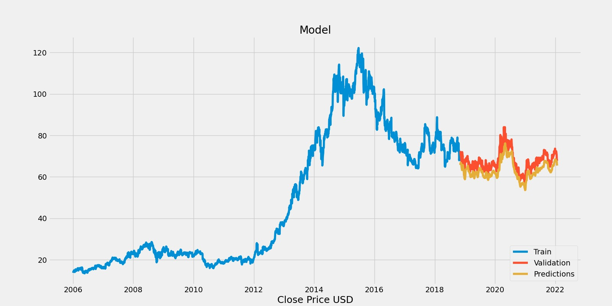
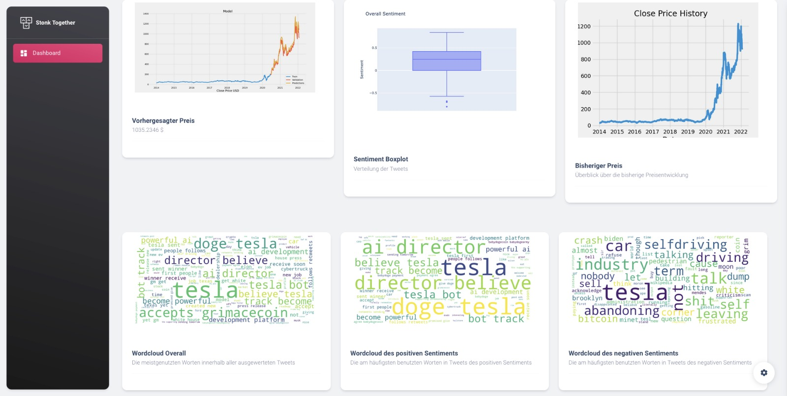

# Stonk2Gether

## Dokumentation
### Disclaimer
Keine Anlageberatung

### Getting Started: 

Folgende Bibliotheken werden benötigt um den Stonk2Gether Code zu starten:
```
pip install numpy

pip install pandas

pip install sklearn.preprocessing

pip install spacy

pip install python-rake

pip install keras

pip install matplotlib

pip install flask
```

# Einleitung

### Team:
Jonas Wuttke, Lukas Bach und Ferdinand Muth

Ein Dashboard, welches das Sentiment zu Unternehmen anzeigt und den Aktienkurs dieser Analysiert und einen Preis für den Nachfolgende Tage verhorsagt.

# Motivation
Spielerische Meinungsbildung und Übersicht über Kurse, allgemeine Themen und Meinungen zu börsennotierten Unternehmen, sowie auf einem Modell basierende Kursvorhersagen.

# Ziel

Schnell und einfach Echtzeit Analysen von Aktienkursen und Sentimenten bekommen.

# Backend

Das Backend läuft über die Flask API. 
Es werden die Code Pipelines der TSA und Sentiment Analyse mithilfe von Inputs im Frontend ausgeführt. 
Dabei kriegt das Backend mithilfe von JavaScript die Daten der Aktien, des Aktienkürzels und die Anzahl der Tweets, die analyisert werden sollen.
Anschließend stellt die Flask API die PNGs der jeweiligen Analysen bereit.

## Wordclouds:





## Time Series Analysis




# Frontend

Das Frontend wurde mit HTML und JavaScript umgesetzt. Zu sehen ist eine Sidebar auf der Linken Seite, die das Logo und die Dashboardseite präsentiert. Die Visualisierungen der Ergebnisse aller Analysen sind in zwei Teile aufgeteilt.
Zum einen wird in der oberen Hälfte der Website der vorhergesehene Preis anhand einer Kennzahl und einem Graph dargestellt. Mittig platziert ist der BoxPlot, der die Ergebnisse der Sentimentanalyse anzeigt. Auf der rechten Seite lässt sich die Preihistorie der angefragten Aktie erkennen.
Auf der unteren Hälfte der Seite werden die erstellten Wordclouds dargestellt, um die Ergebnisse der Sentimentanalyse und der Tweets darzustellen. Dabei wird link auf die Wordcloud aller Tweets, in der Mitte auf die Wordcloud der Tweets mit positivem Sentiment 
und auf der rechten Seite auf die Wordcloud der Tweets mit negativem Sentiment eingegangen.
Mit dem Einstellungsrad auf der rechten unteren Ecke wird ein Einstellungsmenü aufgerufen, in dem die Farbe der Sidebar geändert werden kann, sowie ein Darkmodus aktiviert werden kann.
Zudem kann dort eine Aktienabkürzung und die Anzahl der zu crawlenden Tweets eingegeben werden.



